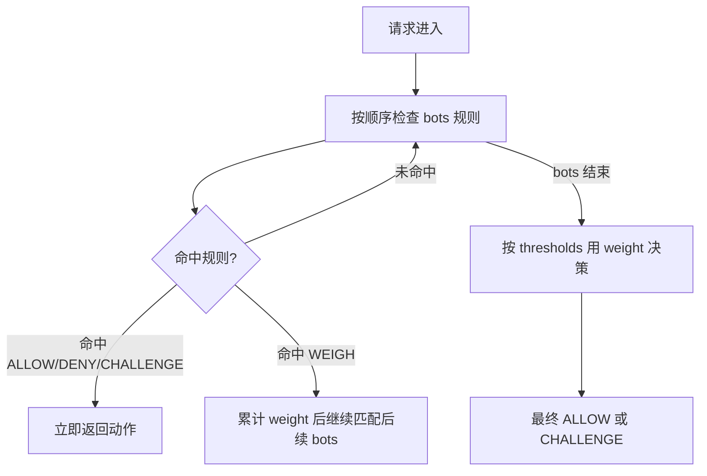

# Anubis

<center>

</center>


[](https://github.com/sponsors/Xe)


## Overview

Anubis is a Web AI Firewall Utility that [weighs the soul of your connection](https://en.wikipedia.org/wiki/Weighing_of_souls) using one or more challenges in order to protect upstream resources from scraper bots.

This program is designed to help protect the small internet from the endless storm of requests that flood in from AI companies. Anubis is as lightweight as possible to ensure that everyone can afford to protect the communities closest to them.

Anubis is a bit of a nuclear response. This will result in your website being blocked from smaller scrapers and may inhibit "good bots" like the Internet Archive. You can configure [bot policy definitions](./docs/docs/admin/policies.mdx) to explicitly allowlist them and we are working on a curated set of "known good" bots to allow for a compromise between discoverability and uptime.

In most cases, you should not need this and can probably get by using Cloudflare to protect a given origin. However, for circumstances where you can't or won't use Cloudflare, Anubis is there for you.

If you want to try this out, visit the Anubis documentation site at [anubis.techaro.lol](https://anubis.techaro.lol).

## Docker Compose 环境变量说明

以下说明对应仓库根目录 `docker-compose.yml` 里的 `anubis.environment` 配置。

### 1) 基础转发与认证流程

| 变量名 | 示例值 | 作用 | 什么时候改 |
| --- | --- | --- | --- |
| `TARGET` | `http://host.docker.internal:3923` | Anubis 后端要反向代理到的上游服务地址。 | 上游服务地址变化时必须改。 |
| `AUTH_MODE` | `pow` | 认证方式。`pow` 表示走 PoW 挑战；`password` 表示走密码页。 | 需要密码登录保护站点时改为 `password`。 |
| `VALID_MODE` | `jwt` | 认证通过后的校验方式。`jwt` 用 JWT cookie；`whitelist` 用 IP 白名单。 | 更偏向无状态校验时用 `jwt`，内网或固定出口可考虑 `whitelist`。 |
| `DIFFICULTY` | `4` | PoW 难度，值越大，客户端计算越慢，防护更强但用户等待更久。 | 被爬虫压力打满时上调；用户抱怨验证慢时下调。 |
| `DEFAULT_FALLBACK_ACTION` | `CHALLENGE` | 没有命中任何规则时的默认动作。常见值：`ALLOW` / `CHALLENGE` / `DENY`。 | 想更保守可用 `CHALLENGE`，完全放行才用 `ALLOW`。 |

### 2) JWT 与会话有效期

| 变量名 | 示例值 | 作用 | 什么时候改 |
| --- | --- | --- | --- |
| `COOKIE_EXPIRATION_TIME` | `168h` | 认证 cookie/JWT 的有效期。`168h` 即 7 天。 | 需要更短会话安全窗口可改小，如 `24h`。 |
| `JWT_RESTRICTION_HEADER` | `X-Real-IP` | 把指定请求头的哈希写入 JWT，后续校验时必须匹配，防止 token 被跨来源复用。 | 反代链路里真实客户端标识不是 `X-Real-IP` 时改成对应头。 |
| `DIFFICULTY_IN_JWT` | `false` | 是否把 challenge 难度写入 JWT claim。主要用于调试或观测。 | 需要排障或做审计时开为 `true`。 |
| `HS512_SECRET`（可选） | `replace-with-a-long-random-secret` | 用固定密钥签 JWT。未设置时会生成临时密钥，重启或多副本会导致 token 不互认。 | 生产环境强烈建议设置，且使用高强度随机字符串。 |

### 3) Cookie 行为

| 变量名 | 示例值 | 作用 | 什么时候改 |
| --- | --- | --- | --- |
| `COOKIE_PREFIX` | `techaro.lol-anubis` | Anubis 使用的 cookie 名前缀。 | 同域下多套 Anubis 实例并存时建议区分前缀。 |
| `COOKIE_SECURE` | `true` | 是否只在 HTTPS 连接上传送 cookie。 | 生产环境应保持 `true`；纯本地 HTTP 调试才考虑 `false`。 |
| `COOKIE_SAME_SITE` | `None` | SameSite 策略，影响跨站请求是否携带 cookie。 | 如无跨站场景可改 `Lax` 提升安全性。 |
| `COOKIE_DYNAMIC_DOMAIN`（可选） | `true` | 按请求域动态推导 cookie 域。 | 需要多子域共享认证时可开启。 |
| `COOKIE_DOMAIN`（可选） | `example.com` | 指定 cookie 的固定 Domain。 | 要跨子域共享 cookie 且域固定时设置。 |
| `COOKIE_PARTITIONED`（可选） | `false` | 是否启用分区 cookie（CHIPS）。 | 有第三方嵌入等特殊场景再评估开启。 |

### 4) 跳转与反向代理安全

| 变量名 | 示例值 | 作用 | 什么时候改 |
| --- | --- | --- | --- |
| `PUBLIC_URL`（可选） | `https://anubis.example.com` | Anubis 对外可访问地址，用于构造某些重定向 URL（如 forwardAuth 场景）。 | 部署在网关后、外网域名与容器内地址不一致时设置。 |
| `REDIRECT_DOMAINS`（可选） | `https://example.com,https://www.example.com` | 限制允许重定向的目标域名，降低开放重定向风险。 | 建议生产始终配置为你的业务域名列表。 |
| `TRUST_X_ORIGINAL_URI` | `false` | 是否信任上游传入的 `X-Original-URI`。默认 `false` 会忽略该头，防止客户端注入影响路径规则。 | 仅在 `subrequest/forwardAuth` 部署且确认头由受信代理设置时改为 `true`。 |

### 5) 日志与密码模式（按需）

| 变量名 | 示例值 | 作用 | 什么时候改 |
| --- | --- | --- | --- |
| `SLOG_LEVEL` | `INFO` | 日志级别，如 `DEBUG` / `INFO` / `WARN` / `ERROR`。 | 排障时临时升到 `DEBUG`，稳定后改回 `INFO`。 |
| `PASSWORD`（仅 password 模式） | `change-me` | 密码认证口令。 | `AUTH_MODE=password` 时必填，且应使用强密码。 |
| `PASSWORD_MAX_FAILS`（仅 password 模式） | `10` | 单 IP 允许的最大失败次数。 | 暴力破解多时下调。 |
| `PASSWORD_BAN_TIME`（仅 password 模式） | `900` | 超过失败阈值后的封禁时长（秒）。 | 需要更强限制可上调。 |
| `WHITELIST_TIMEOUT`（仅 whitelist 模式） | `3600` | IP 白名单模式下的有效期（秒）。 | `VALID_MODE=whitelist` 时按业务调整。 |

## 策略加载与覆盖关系

### 1) 默认会加载什么

- 未设置 `POLICY_FNAME` 时，Anubis 会加载内置策略 `(data)/botPolicies.yaml`。
- 默认不会自动加载 `data/custom/*`。
- 默认也不会自动加载 `(data)/apps` 或 `(data)/meta` 整个目录，只会加载 `botPolicies.yaml` 中明确写了 `import` 的文件。

### 2) 设置 `POLICY_FNAME` 后会怎样

- 设置 `POLICY_FNAME` 后，Anubis 只读取你指定的策略文件，不再自动读取默认 `(data)/botPolicies.yaml`。
- 如果你想在自定义策略里保留默认行为，需要手动 `import`（例如 `- import: (data)/meta/default-config.yaml`）。

### 3) `import` 是什么

- `import` 会把目标规则文件“展开”到当前 `bots` 列表中，按当前顺序参与匹配。
- 规则是按顺序执行，命中 `ALLOW` / `DENY` / `CHALLENGE` 就立即返回；`WEIGH` 只会累计权重并继续。

### 4) 只写黑名单会发生什么

- 如果你只配置黑名单（例如若干 `DENY`）且不导入默认配置，那么 `bots` 阶段只会执行这些黑名单。
- 但若你没显式写 `thresholds`，系统会自动补默认阈值。
- 在“只有黑名单且没有 WEIGH”的常见情况下，未命中黑名单的请求通常会 `ALLOW`（因为默认阈值中 `weight <= 0` 为放行）。

## 策略配置教程（含示例）

### 1) 最小流程

1. 新建策略文件，例如 `data/custom/botPolicies.custom.yaml`。
2. 在 `bots:` 下按顺序写规则（顺序非常重要）。
3. 需要保留默认行为时，在文件里显式 `import` 默认规则。
4. 在 `docker-compose.yml` 中挂载该文件，并设置 `POLICY_FNAME`。
5. 重启容器使配置生效。

### 2) 示例 A: 仅黑名单（其余默认放行）

```yaml
bots:
  - name: deny-bad-bot
    user_agent_regex: (?i:evil-bot|scrapy|python-requests)
    action: DENY
```

说明:
- 这个配置只定义了黑名单规则。
- 若未额外定义 `thresholds`，未命中黑名单的请求通常会走默认阈值中的 `ALLOW`。

### 3) 示例 B: 路径白名单 + 敏感路径 challenge

```yaml
bots:
  - name: allow-healthz
    path_regex: ^/healthz$
    action: ALLOW

  - name: allow-public-api
    path_regex: ^/api/public(/.*)?$
    action: ALLOW

  - name: challenge-sensitive
    path_regex: ^/(admin|login|signin)(/.*)?$
    action: CHALLENGE
    challenge:
      algorithm: fast
      difficulty: 4
```

说明:
- 放行规则放在前面，避免被后续规则覆盖。
- 命中 `CHALLENGE` 后会立即进入挑战流程。

### 4) 示例 C: 在默认规则基础上叠加自定义

```yaml
bots:
  - name: allow-healthz
    path_regex: ^/healthz$
    action: ALLOW

  - name: challenge-sensitive
    path_regex: ^/(admin|login|signin)(/.*)?$
    action: CHALLENGE
    challenge:
      algorithm: fast
      difficulty: 4

  - import: (data)/meta/default-config.yaml
```

说明:
- `POLICY_FNAME` 指向自定义文件后，默认策略不会自动加载。
- 通过 `import: (data)/meta/default-config.yaml` 可以把默认规则重新引入。

### 5) Docker Compose 配置示例

```yaml
services:
  anubis:
    image: ghcr.io/rain-kl/anubis:latest
    volumes:
      - ./data/custom/botPolicies.custom.yaml:/data/cfg/botPolicies.custom.yaml:ro
    environment:
      POLICY_FNAME: "/data/cfg/botPolicies.custom.yaml"
      DEFAULT_FALLBACK_ACTION: "CHALLENGE"
```

应用配置:
```bash
docker compose up -d --force-recreate anubis
```

## 默认机器人判定规则

当前默认配置 `data/botPolicies.yaml` 实际启用的默认判定规则说明。

默认判定流程：



说明：
- 规则按顺序执行，先匹配先生效。
- `WEIGH` 不直接放行/拒绝，只增加或减少可疑权重。
- `remote_addresses`、`geoip`、`asns` 都基于 `X-Real-Ip`。

### A. 默认 bots 规则（按执行顺序）

| 顺序 | 规则名 | 判断条件（摘要） | 动作 |
| --- | --- | --- | --- |
| 1 | `cloudflare-workers` | 请求头存在 `CF-Worker` | `WEIGH +15` |
| 2 | `lightpanda` | `User-Agent` 匹配 `^LightPanda/.*$` | `DENY` |
| 3 | `headless-chrome` | `User-Agent` 包含 `HeadlessChrome` | `DENY` |
| 4 | `headless-chromium` | `User-Agent` 包含 `HeadlessChromium` | `DENY` |
| 5 | `us-artificial-intelligence-scraper` | `User-Agent` 匹配 `+https://github.com/US-Artificial-Intelligence/scraper` | `DENY` |
| 6 | `custom-async-http-client` | `User-Agent` 包含 `Custom-AsyncHttpClient` | `WEIGH +10` |
| 7 | `alibaba-cloud` | 来源 IP 命中阿里云 CIDR 列表 | `DENY` |
| 8 | `huawei-cloud` | 来源 IP 命中华为云 CIDR 列表 | `DENY` |
| 9 | `deny-aggressive-brazilian-scrapers` | 命中一组可疑 UA 特征（如 `MSIE`/`Trident`/`Presto`/`Windows 95`/`iPod` 等）任一项 | `WEIGH +20` |
| 10 | `ai-catchall` | `User-Agent` 命中大范围 AI/LLM 相关 UA 正则集合 | `DENY` |
| 11 | `ai-clients` | `User-Agent` 命中 `ChatGPT-User`/`Claude-User`/`MistralAI-User`/`Perplexity-User` | `DENY` |
| 12 | `ai-crawlers-search` | `User-Agent` 命中 `OAI-SearchBot`/`Claude-SearchBot`/`PerplexityBot` | `DENY` |
| 13 | `ai-crawlers-training` | `User-Agent` 命中 `GPTBot`/`ClaudeBot` | `DENY` |
| 14 | `googlebot` | `User-Agent` 匹配 Googlebot 标识且来源 IP 在 Google 公布网段 | `ALLOW` |
| 15 | `applebot` | `User-Agent` 包含 `Applebot` 且来源 IP 在 Apple 公布网段 | `ALLOW` |
| 16 | `bingbot` | `User-Agent` 匹配 Bingbot 标识且来源 IP 在 Bing 公布网段 | `ALLOW` |
| 17 | `duckduckbot` | `User-Agent` 匹配 DuckDuckBot 标识且来源 IP 在 DuckDuckGo 公布网段 | `ALLOW` |
| 18 | `qwantbot` | `User-Agent` 匹配 QwantBot 标识且来源 IP 在 Qwant 公布网段 | `ALLOW` |
| 19 | `internet-archive` | 来源 IP 在 Internet Archive 网段 | `ALLOW` |
| 20 | `kagibot` | `User-Agent` 匹配 KagiBot 标识且来源 IP 在 Kagi 公布网段 | `ALLOW` |
| 21 | `marginalia` | `User-Agent` 匹配 marginalia 标识且来源 IP 在其公布网段 | `ALLOW` |
| 22 | `mojeekbot` | `User-Agent` 匹配 MojeekBot 标识且来源 IP 在其公布网段 | `ALLOW` |
| 23 | `common-crawl` | `User-Agent` 包含 `CCBot` 且来源 IP 在 Common Crawl 网段 | `ALLOW` |
| 24 | `yandexbot` | `User-Agent` 命中 Yandex 标识且 `verifyFCrDNS(remoteAddress)` 反向校验通过 | `ALLOW` |
| 25 | `x-firefox-ai` | 存在请求头 `X-Firefox-Ai` | `WEIGH +5` |
| 26 | `well-known` | 路径匹配 `^/\\.well-known/.*$` | `ALLOW` |
| 27 | `favicon` | 路径匹配 `^/favicon\\.(?:ico|png|gif|jpg|jpeg|svg)$` | `ALLOW` |
| 28 | `robots-txt` | 路径匹配 `^/robots\\.txt$` | `ALLOW` |
| 29 | `sitemap` | 路径匹配 `^/sitemap\\.xml$` | `ALLOW` |
| 30 | `countries-with-aggressive-scrapers` | `geoip` 国家为 `BR` 或 `CN`（需 Thoth） | `WEIGH +10` |
| 31 | `aggressive-asns-without-functional-abuse-contact` | ASN 在 `13335`、`136907`、`45102`（需 Thoth） | `WEIGH +10` |
| 32 | `generic-browser` | `User-Agent` 包含 `Mozilla` 或 `Opera` | `WEIGH +10` |

注意：
- 第 30、31 条在未配置 Thoth 客户端时会被跳过，不参与匹配。
- `ai-block-aggressive` 是默认启用策略，所以 AI 客户端/爬虫在默认配置下是优先拒绝的。

### B. 默认 thresholds（weight 到动作的映射）

| 阈值名 | 条件 | 动作 | Challenge 参数 |
| --- | --- | --- | --- |
| `minimal-suspicion` | `weight <= 0` | `ALLOW` | 无 |
| `mild-suspicion` | `0 < weight < 10` | `CHALLENGE` | `algorithm: metarefresh`, `difficulty: 1` |
| `moderate-suspicion` | `10 <= weight < 20` | `CHALLENGE` | `algorithm: fast`, `difficulty: 2` |
| `mild-proof-of-work` | `20 <= weight < 30` | `CHALLENGE` | `algorithm: fast`, `difficulty: 4` |
| `extreme-suspicion` | `weight >= 30` | `CHALLENGE` | `algorithm: fast`, `difficulty: 6` |

### C. 默认行为结论（你最关心的“怎么判机器人”）

- 明确命中恶意特征或云网段黑名单：直接 `DENY`。
- 明确命中可信搜索爬虫并通过 IP/反向 DNS 校验：`ALLOW`。
- 普通浏览器流量大多会先命中 `generic-browser` 得到 `weight +10`，再进入阈值，通常会走 challenge。
- 没命中任何 bots 的请求会以 `weight=0` 进入阈值，默认落在 `minimal-suspicion`，即 `ALLOW`。
